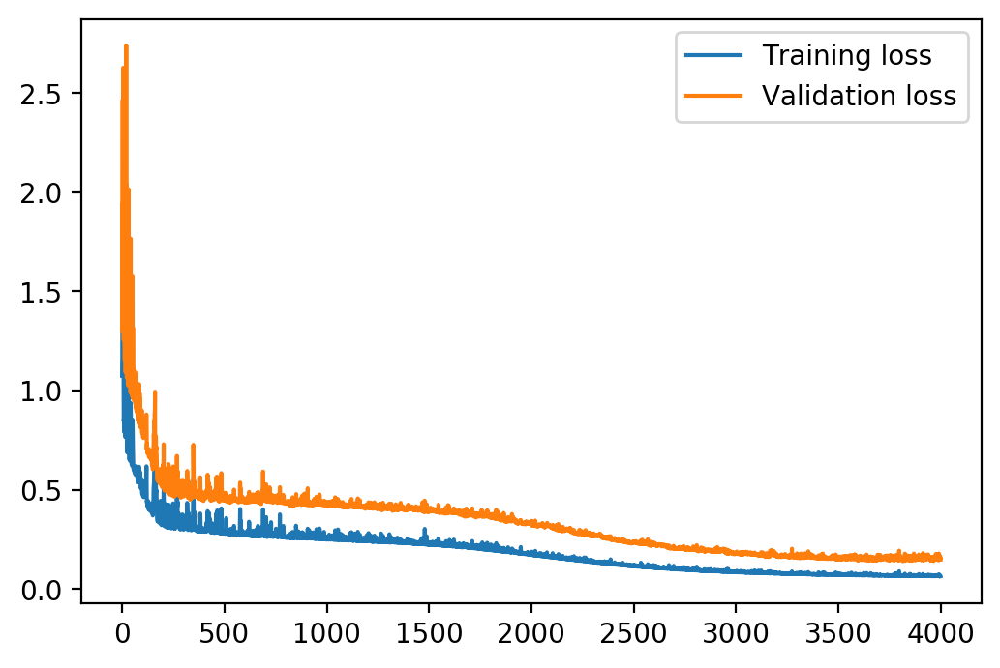
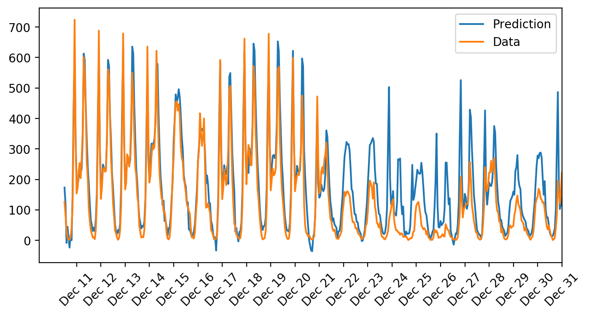

# Predicting Bike Sharing Patterns 

## Overview
In this project, I've build a neural network from scratch to predict daily bike rental ridership. Building a neural network from the ground up provides a much better understanding of gradient descent, backpropagation, and other concepts that are important to know before one moves to higher-level tools such as Tensorflow or PyTorch. 

 

### The Goals of this Project:
* Load and prepare the data 
   * Create "Dummy" variables from categorical variables
   * Scaling target variables by shifting them to zero mean and standardize them
   * Splitting the data into training, testing, and validation sets
* Building Neural Network
* Perform unit tests to check the correctness of the network implementation
* Training the network
  * Choose the number of iterations
  * Choose the learning rate
  * Choose the number of hidden nodes
* Check out your predictions on test data

### Project Files
The project includes the following files:
* `README.md` - A markdown file explaining the project structure and training approach
* `Predicting_bike_sharing_data.ipynb` - Jupyter Notebook describing the project
* `my_answers.py` - Script containing the Neural network class definition and hyperparameter setting

## Neural Network Model Architecture

The model architecture consists of a very simple stack with one hidden layer. The following table shows the final model architecture:

|Layer|Description|Param #|
|---|---|---|
|Fully connected | Input size 56 |0|
|Fully connected| output 16, activation:sigmoid| 896|
|Fully connected| output 1, activation:linear| 16|

* Total params: 912

## Results
Training and Validation loss over all iterations

Future Prediction on test data

